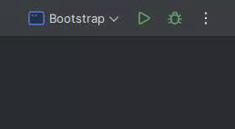

# Contributing

## How to run deobfuscator
1. Navigate to class `deobfuscator-impl/src/test/java/Bootstrap`
2. In this class edit the deobfuscator configuration
    - `input` - Your input jar file
    - `transformers` - Pick transformers that you want to run. You can find them in `deobfuscator-transformers` module.
3. Run this class manually from your IDE

4. 

## Project structure
The project is structured as follows:
- `deobfuscator-api` - The API for the deobfuscator.
- `deobfuscator-impl` - The main deobfuscator runner.
- `deobfuscator-transformers` - Transformers for the deobfuscator.
- `deobfuscator-transformers-analyzer` - Analyzer-like transformers
- `testData` - Tests for transformers
  - `src/java` - You can write your java code to test transformers
  - `compiled/custom-classes` - Compiled classes to test transformers. You can throw here classes from your obfuscated jars.
  - `compiled/custom-jars` - Jars to test transformers. You can throw here your obfuscated jars.
  - `results` - Expected results that are auto-generated decompiled java code
- `deobfuscator-impl/src/test/java/uwu/narumii/deobfuscator/TestDeobfuscation` - Class where each test sample is registered.

## Testing
You can create your own tests for transformers.
- If the obfuscation is simple enough, you can write your own sample in `testData/src/java`.
- If the obfuscation is more complex, you can throw your obfuscated classes in `testData/compiled/custom-classes` and test transformers on them.
- You can also throw your obfuscated jars in `testData/compiled/custom-jars` and test transformers on them.

You need to register each sample in class `deobfuscator-impl/src/test/java/uwu/narumii/deobfuscator/TestDeobfuscation`

